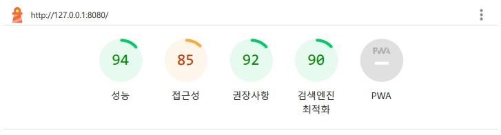
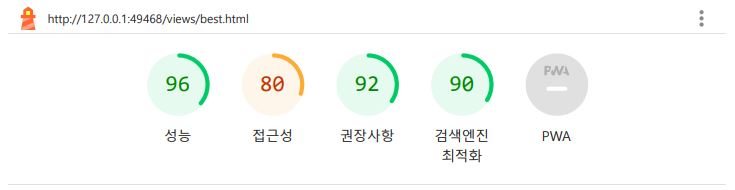
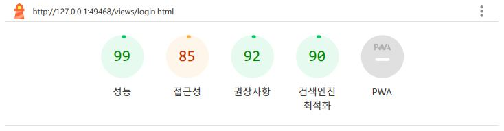
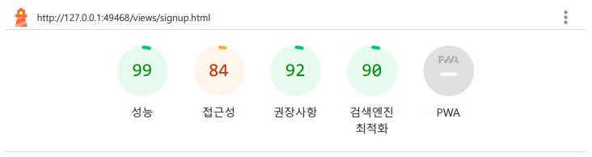

# 멋쟁이사자처럼 FE 6기 바닐라프로젝트 ( HTML/CSS ) - 망글망글망글조

## 목차

1. [프로젝트 설명](#프로젝트-설명)
2. [망글칼리 설명](#망글칼리-설명)
3. [성능테스트 결과](#성능테스트-결과)
4. [마무리하며](#마무리하며)

 
 

## 프로젝트 설명

### 프로젝트명

> 🐻‍❄️ 망글망글 망글칼리
> [🔗페이지보러가기](https://mangeul-karly.netlify.app/)

 

### 프로젝트 조원

- 조장 : 김규민
- 조원 : 김건주, 김병훈, 홍다영

 

### 역할 분담

- 김규민 : 스크럼 마스터, 로그인 폼, 회원가입 폼, 접근성 검토
- 김건주 : 메인섹션, 베스트페이지, 특가/혜택페이지 메인영역, 접근성 검토
- 김병훈 : 공통헤더, 검색 엔진 최적화, 성능 테스트
- 홍다영 : 공통푸터, 최종 페이지 세부 레이아웃 조정

 

### 프로젝트 목표

1. 각자 담당한 파트 프로젝트 기한 내 완료하기
2. 고정형 시안 페이지 4개 구현하기
3. 반응형까지 고려한 설계보다 하나의 페이지를 완벽하게 만드는 것에 초점두기
4. 목표 완료 후 최대한 많은 페이지 구현하기
5. 서로 도와가며 모르는 부분은 바로바로 물어보며 서포트해주기

 

### 사용기술

`HTML` `Sass`

협업에서의 편리한 작업 및 코드 가독성을 높이기 위한 방안으로서, CSS 코드를 모듈화 및 재사용하며 작업하기 위해 CSS 전처리기인 Sass를 사용하였습니다.

 
 

## 망글칼리 설명

 

### 망글칼리의 웹은 무엇을 하는가

다양한 식재료부터 뷰티 제품까지 빠른 배송으로 받아볼 수 있는 온라인 쇼핑 웹 사이트

 

### 망글칼리에서 구현해낸 기능

- 공통헤더 :

1. `display: grid` 를 활용하여 헤더 전체 영역을 나누고 각각 요소들을 배치하였습니다.
2. 검색폼 안에 `Button` 요소를 추가하여 검색 버튼을 추가하였습니다.
3. 헤더 내 망글칼리, 뷰티칼리 / 회원가입, 로그인, 고객센터 요소들을 `ul`>`li` 태그로 구성하고, `display:flex` 를 줘 나란히 배치하였습니다.

- 공통네비 :

1. 내비게이션 섹션 안 메인 메뉴를 `display:flex`로 배치하였습니다.
2. 각각 메뉴별 마우스를 올리면 망글칼리 'primary-color'로 변하게 `hover` 효과를 주었습니다.
3. 카테고리에 마우스를 올리면 세부 카테고리가 펼쳐지도록 `@mixin slideList` 을 만들어 사용하였고, nav 영역 아래의 슬라이드 광고 위에 세부 카테고리가 나오도록 `z-index:1`을 주었습니다.
4. 세부 카테고리 리스트 위치를 조정하기 위해 `position:absolute`를 줘 위치를 고정시켰습니다.
5. 세부 카테고리 내 리스트별 이미지를 삽입하기 위해 'sprite' 요소를 함수로 만들어 사용하였습니다.

 

- 메인영역 :

1. 메인페이지에 슬라이드 광고 효과를 넣어주려고 `animation` 효과를 주었습니다.
2. 실제 작동하지는 않지만 사용자가 슬라이드 광고를 멈추고 싶을 때 멈출 수 있도록 정지버튼도 구현해놓았습니다.
3. 글자에 마우스를 올렸는지 눈으로 확인할 수 있게 `hover` 시 글자색이 변하게 만들었습니다.
4. 조건 필터 카테고리를 `input type=checkbox` 로 하여 클릭 시 리스트가 내려올 수 있도록 `animation` 효과를 적용해주었습니다.
5. 최근 본 상품 모달창을 만들어 `position: fixed` 를 주어 브라우저 오른쪽에 붙게 만들었습니다. 그리고 메인영역 안에서만 움직일 수 있도록 메인영역 전체 컨테이너에 `position: relative`를 주었습니다.
6. 마켓컬리 홈페이지와 동일한 효과를 주고 싶어 상품 이미지에 마우스를 올렸을 때 이미지가 살짝 커지게 만들려고 `transform: scale`을 주었습니다.
7. 장바구니 이미지를 클릭했을 때 '상품이 장바구니에 담겼습니다' 라는 정보를 사용자에게 알려주고 싶어 모달창을 만들어주었습니다.
8. tab이동 시 자연스럽게 홈페이지의 흐름을 읽을 수 있도록 키보드가 접근하지 않는 곳은 `tabindex="0"`, 사용자가 이해하지 못할 것 같은 곳은 `aria-label=""`을 추가하였고 사용자에게 불필요한 정보는 `aria-hidden="true"`를 주어 접근성을 높이고자 했습니다.

 

- 공통푸터 :

1. 각각 제목인 카카오톡문의, 1:1문의, 대량주문에 내용을 2개씩 배치하기 위해서 정의형 목록을 만들어주었습니다.
2. 네모 모양 안에 카카오톡 문의,1:1문의,대량주문 글자가 들어가야 해서 `width`와 `height`, 그리고 `@include marginY(28px)`로 크기와 배치를 설정하였습니다.
3. 레이아웃 배치는 `display: flex`를 사용하였습니다.
4. 이메일 등 글자를 보라색으로 해야 하는 것은 `color: $primary_color`로 설정하였습니다.

 

- 로그인 / 회원가입 폼 :

1. 입력창에 포커싱 할 때 테두리 색이 바뀌어 어떤 입력란에 포커싱했는지 확인할 수 있도록 디자인했습니다.
2. `radio/checkbox` 요소의 아이콘을 `` 요소 + `background` 속성으로 추가한 후 `checked` (체크/체크해제) 상태에 따라 이미지가 변경되도록 구현했습니다.
3. 회원가입 페이지는 `display: flex`로 레이아웃 구성, 로그인폼은 `fieldset`을 사용하여 단순 css를 레이아웃 구성했습니다.

 

## 성능테스트 결과

1. index.html
   

2. best.html
   

3. login.html
   

4. signup.html
   

 

## 마무리하며

- 김규민 : 이번 프로젝트로 협업을 처음으로 해봤는데 너무 재밌게 시간가는 줄 모르고 참여했습니다! 저는 로그인 폼과 회원가입 폼을 담당했는데, 몇 번 만들어봤던 로그인 폼은 쉽게 만들었지만 회원가입 폼은 쉽지 않았지만 많이 찾아보고 혼자 공부하는 시간을 가질 수 있었습니다. 코드 작성과 별개로 조장과 스크럼 마스터 역할을 진행하면서 저희 망글 조원들이 협업 툴을 이용할 때 어려워하는 부분에 대한 해결 방안을 찾아보고, 해결하는 경험이 너무 재밌었고, 다음 프로젝트에도 스크럼 마스터를 진행하고 싶다는 생각이 들었습니다. 주말 포함 6일 동안 같이 고생하신 망글7조 조원분들 감사하고 수고하셨습니다!!

 

- 김건주 : 이번 프로젝트를 통해 부모요소와 자식요소, 형제관계 등 요소들의 관계성에 대해 생각하고 배울 수 있었습니다. 그리고 가장 어려워했던 `transition` 기능을 활용하여 많은 것들을 구현할 수 있다는 점도 배울 수 있었습니다. 자바스크립트를 알지 못해 실무용으로 사용하는 기술이 아닌 그저 레이아웃 구현용으로만 했던 점이 아쉬워서 나중에 자바스크립트를 배워서 그부분을 수정하고 싶습니다. 마지막으로 멋사에 들어온 가장 큰 이유인 조원들과의 협업을 통한 프로젝트를 드디어 해보았고 너무 좋은 경험이 되었습니다. 사람들과 소통하는 것을 어려워하던 저로써는 많은 대화를 할 수 있던 경험이였고 모르던 것을 공유하고 배움으로써 프로젝트 시작 전보다 성장한 점이 이번 프로젝트를 통해 얻은 가장 큰 점인 것 같습니다.

 

- 김병훈 : 좋았던 점은 목표한 범위를 기한에 맞춰 완료했다는 뿌듯함, 바로바로 물어볼때마다 개발위키처럼 답을 알려주셔서 든든했습니다. 그리고 조장님의 리딩이 매끄러워 갈등없이 첫 프로젝트가 완료되었고 어느 누구 하나 힘든티를 안내고 합심했습니다. 아쉬웠던 점은 기한 내 범위 완료 후 추가 페이지를 작업하고 싶었는데 거기까지는 하지 못해서 아쉬웠습니다. 또 Git 충돌을 프로젝트 마지막에 경험해서 미리 많이 안겪어본 아쉬움이 있었고 html/css로만 구현해야 한다는 생각이 있었던점이 아쉬웠습니다. 나중에 구현하고 싶은 부분은 반응형과 자바스크립트로 카테고리 리스트 구현, 추가페이지 등 여러것을 더 만들어보고싶습니다.

 

- 홍다영 : 배운점은 sass 사용하는 방법을 조금 알게 된 것 같고, 마크업과 스타일 설정, 그리고 배치에 대해 조금 더 배운 것 같습니다. 느낀점은 프로젝트를 하면서 많이 부족하다는 생각을 하게 되었고, 익숙하지도 않아서 느리다고 느껴져서 많이 해보야겠다고 생각하였습니다. 더 공부해서 구현을 하게 된다면 일부 메인부분을 조금씩 구현해보고 싶습니다.
